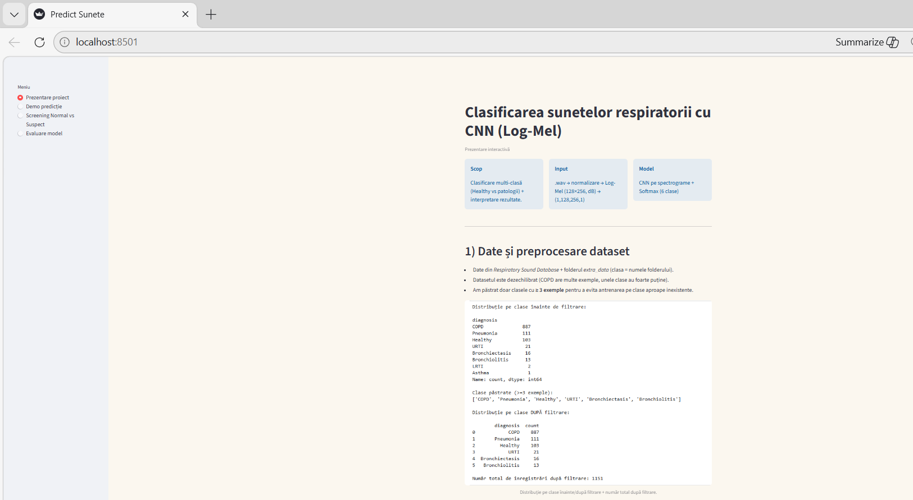
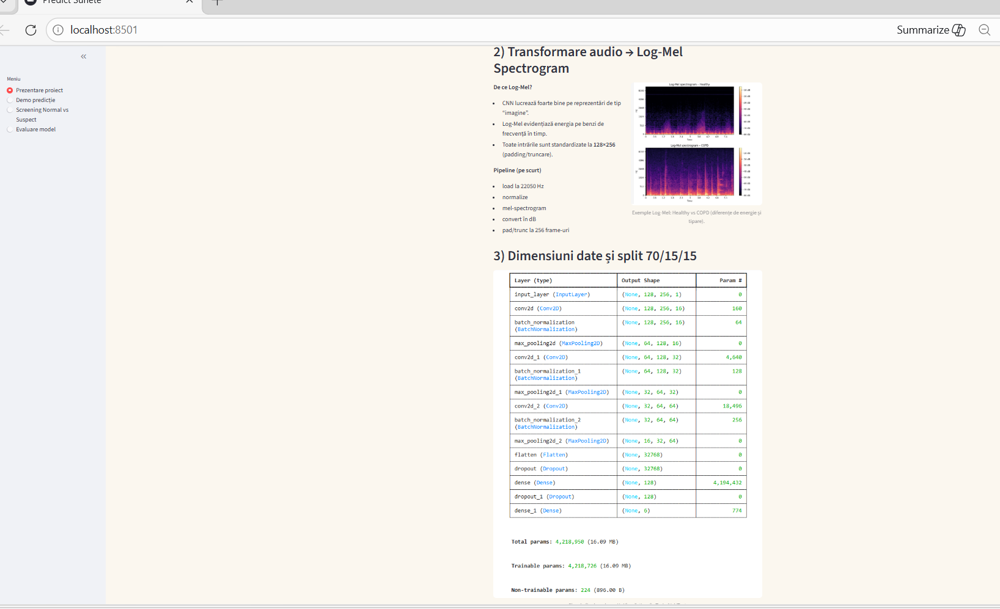
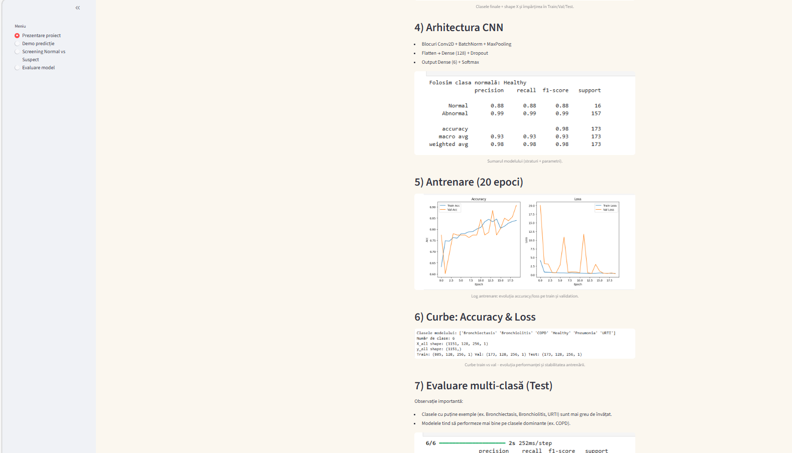
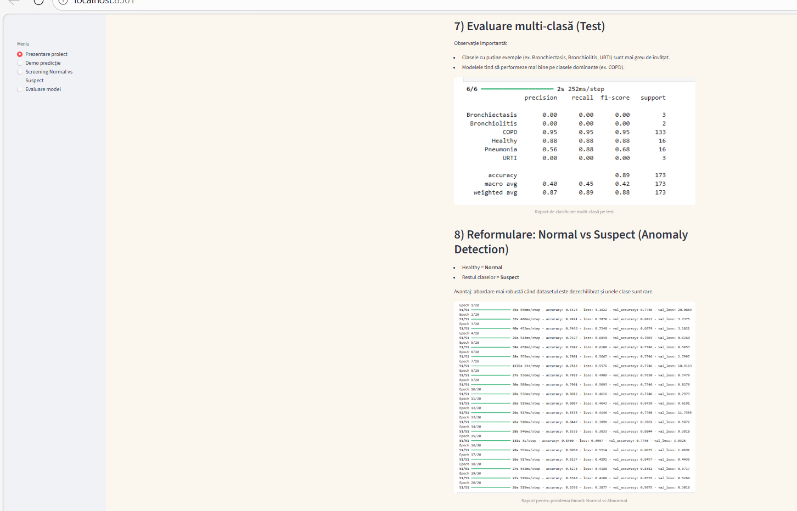
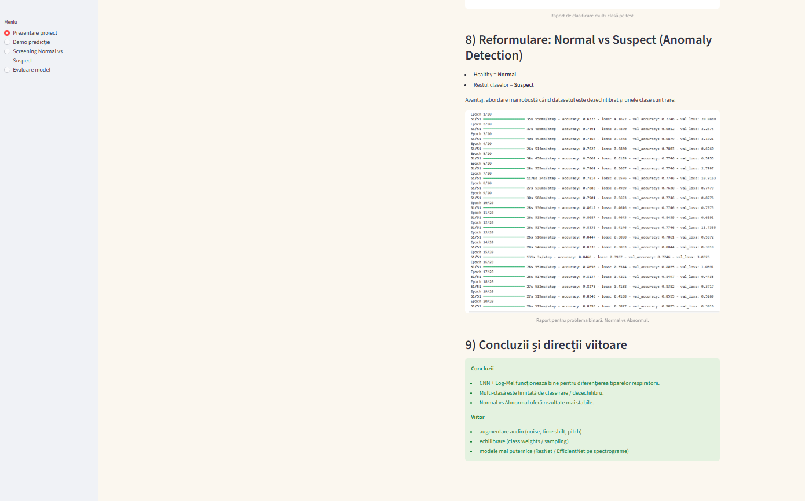
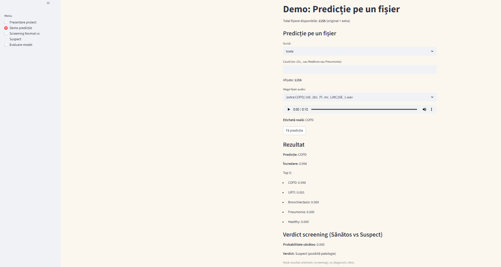
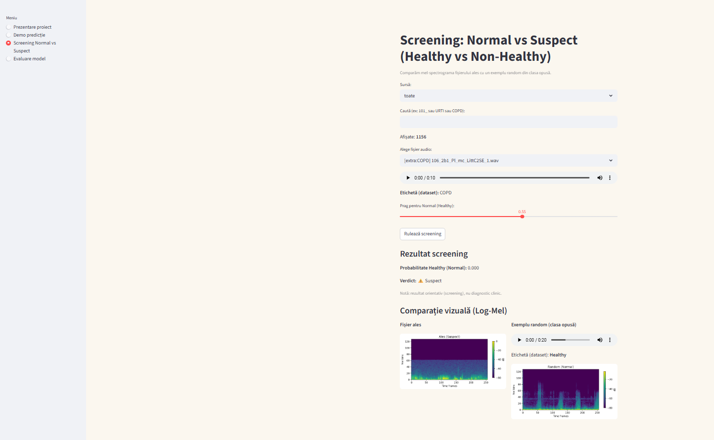
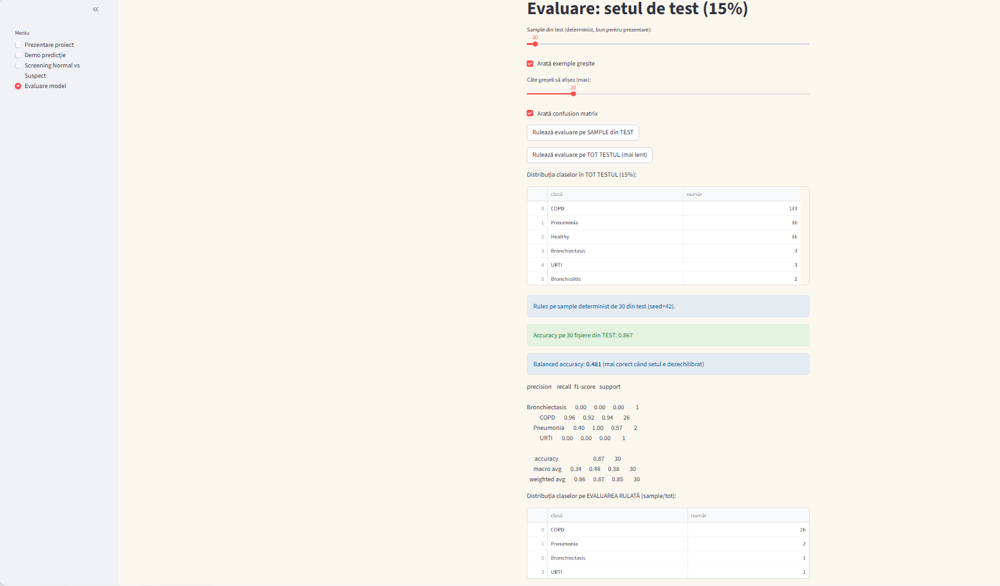
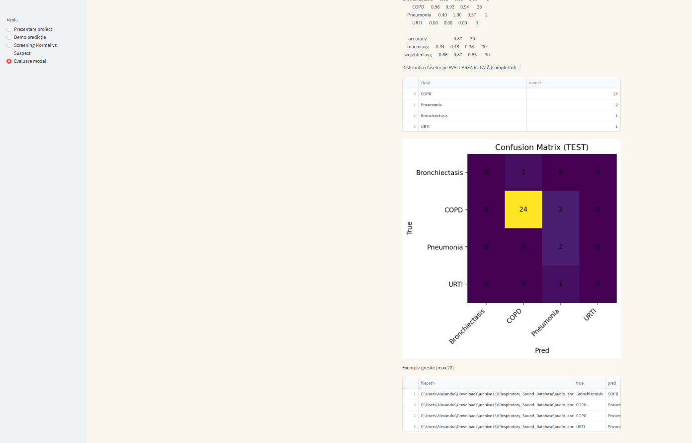

# Lung Sound Classification and Anomaly Detection

## Description
This project focuses on the automatic analysis of lung sounds using deep learning techniques.
Audio recordings are transformed into Log-Mel spectrograms and classified using a Convolutional Neural Network (CNN).

## Project Objectives
- Lung sound classification into multiple respiratory conditions
- Feature extraction using Log-Mel spectrograms
- CNN-based multi-class classification
- Reformulation as anomaly detection (Normal vs Abnormal)

## Dataset
The dataset consists of lung sound recordings in WAV format, associated with medical diagnoses such as:
Healthy, COPD, Pneumonia, URTI, Bronchiectasis and Bronchiolitis.

## Methods
- Audio preprocessing and normalization
- Log-Mel spectrogram generation
- CNN architecture with Batch Normalization and Dropout
- Model evaluation using precision, recall, F1-score
- Anomaly detection formulation

## Tools & Technologies
- Python
- Librosa
- NumPy
- TensorFlow / Keras
- Matplotlib

## Results
- Multi-class classification accuracy: ~89%
- Anomaly detection accuracy (Normal vs Abnormal): ~98%

## Documentation
The full project report is available in the `report` folder.

## How to Run
1. Install dependencies:
   - numpy
   - librosa
   - tensorflow
   - matplotlib
   - scikit-learn

2. Open the notebook using Jupyter Notebook or JupyterLab:
```bash
jupyter notebook lung_sound_classification.ipynb

## Demo (Streamlit UI) – Screenshots

The Streamlit app runs locally (`localhost:8501`) and includes: pipeline overview (Log-Mel + CNN), multi-class prediction demo, Healthy vs Suspect screening, and model evaluation on the test set.

### 1) Project overview + dataset & preprocessing


### 2) Log-Mel spectrogram + input shape / dimensions


### 3) CNN architecture + training curves


### 4) Multi-class evaluation (classification report)


### 5) Reformulation: Normal vs Suspect (anomaly detection)


### 6) Conclusions and future work


### 7) Demo: prediction on a single audio file (result + top-5)


### 8) Screening: Healthy vs Non-Healthy (threshold + Log-Mel comparison)


### 9) Test evaluation (accuracy + balanced accuracy + confusion matrix)



   


